# 亿级信息发布与订阅系统架构设计：从发布到时间线

## 引言：一条内容如何抵达千万时间线

当大V发布一条内容，需要在数秒内出现在千万粉丝的时间线里；普通用户发布，也要在好友的时间线中有良好曝光。这背后是“高吞吐写入 + 扇出分发 + 低延迟读取 + 排序推荐”的系统工程。

本文延续关系链的思路，给出信息发布（Feed/Timeline）在亿级规模下的可落地架构：选型、数据模型、分片与热点、写读路径、缓存与排序、最终一致性与修复，以及 PostgreSQL 的实践要点与本地可验证路径。

---

## 可视化总览

架构鸟瞰（发布→CDC→扇出→时间线读取）：

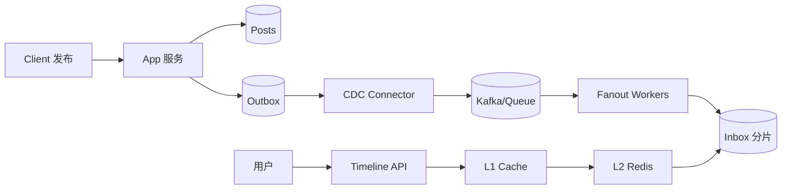

---

## 第一部分：业务与查询模型

核心实体与场景：

- 内容（Post）：作者、文本/媒体、可见性（公开/粉丝/私密/黑名单过滤）、创建时间、分发策略标签。
- 时间线（Timeline/Inbox）：为每个用户准备的“候选内容列表”（按时间与得分排序）。
- 查询：
  - 拉取时间线：GET /timeline?limit=&cursor=（seek 分页）
  - 作者页：GET /u/:id/posts
  - 互动：点赞/评论/转发计数（延迟一致/最终一致）

关键非功能目标：

- 写入（发布）P99 < 数十毫秒（不含全量扇出）；时间线查询 P99 < 数十毫秒；大促/热点具备弹性扩展与削峰。
- 大V发布不拖垮系统；最终一致性窗口可观测（秒级），可自动修复。

---

## 第二部分：扇出策略（写时/读时/混合）

三种经典策略：

- Fan-out-on-write（写时扇出，Push）：发布后将 post 推送到粉丝的 inbox 表，读时直接命中单分片。优点：读快；缺点：大V发布时写放大严重。
- Fan-out-on-read（读时扇出，Pull）：读时间线时，从作者 outbox + 关系链组合计算，或从公共池/索引过滤。优点：写轻；缺点：读压大且复杂（易出现扇出查询）。
- 混合（Hybrid）：普通作者写时扇出；大V/热点作者读时拉取或延迟批量推送到部分人群（分层下发/节流）。

推荐：混合策略（默认 Push，热点作者采用 Pull 或分层 Push），配合多级缓存与批处理，能在“查询体验”和“热点抗压”之间取得平衡。

---

可视化：扇出策略选择（按发布者规模与实时性要求）：

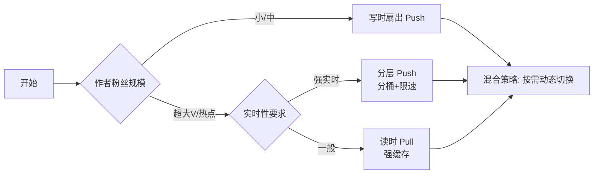

---

## 第三部分：数据模型与索引

表与主索引（PostgreSQL 术语，按业务优化）：

- posts（内容主体，按时间分区）
  - id (snowflake/ULID), author_id, visibility, payload(jsonb), created_at(ts)
  - 分区：Range by day/week/month（热数据在少量分区内）
  - 索引：(author_id, created_at DESC), BRIN(created_at) 以降低大表维护成本

- outbox（作者外发盒，用于 CDC/回放/补偿）
  - post_id PK, author_id, created_at, status
  - 事务内落表（Outbox Pattern），由 CDC 拉取并驱动后续扇出

- inbox（时间线，用户维度存储，按 user_id 分片/桶）
  - user_id, post_id, score, created_at，PRIMARY KEY(user_id, post_id)
  - 复合索引：(user_id, score DESC, post_id DESC) 支持 seek 分页
  - 仅冗余 post_id/score/created_at（及必要的 publisher_id），正文与媒体仅保存在 posts/对象存储，避免重复存储与写放大
  - 分片：user_id → virtual shard → 物理库/表；大V粉分桶（per-user buckets）

- counts（计数与派生指标）
  - post_id, like_count, comment_count, repost_count, last_agg_at
  - 更新通过事件流异步聚合（幂等增量 + 定期校准）

可见性与屏蔽：

- visibility_rules：黑白名单、分组、地理限制等（读时过滤或写时预计算标签）。

数据关系（简化 ER）：

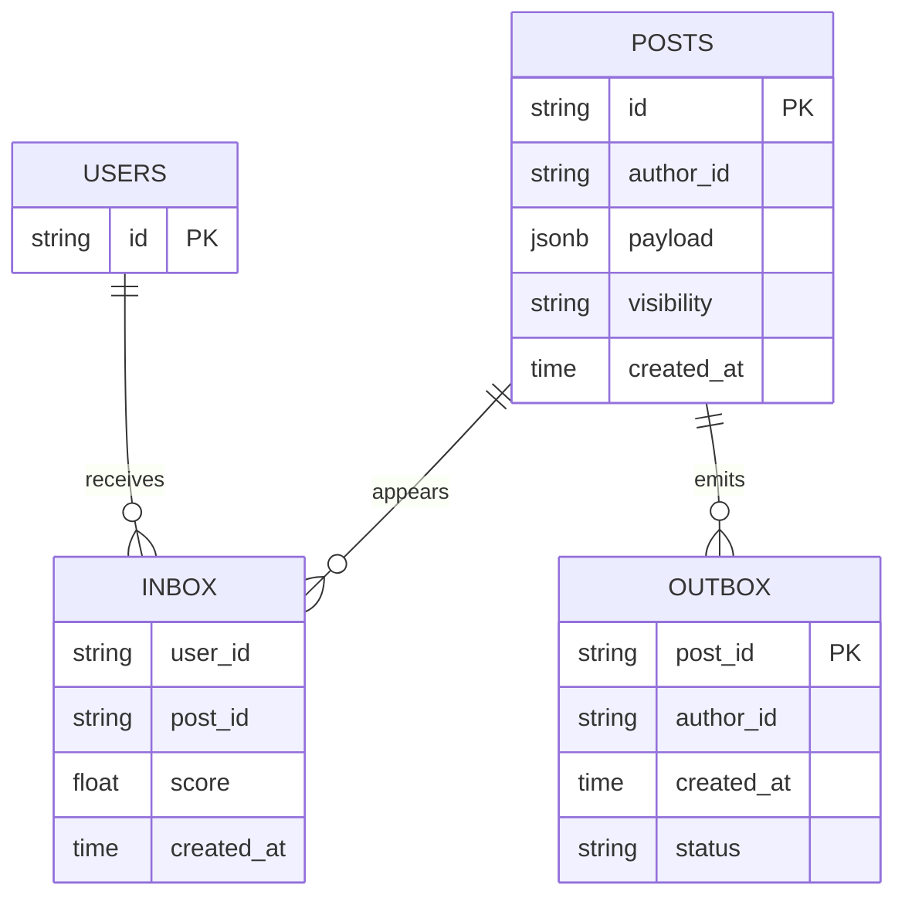

---

## 第四部分：分片与热点治理

- 虚拟分片：避免 user_id % N 的重分布代价，支持平滑扩容/缩容。
- 大V热点：
  - 写路径：对大V粉丝分桶（N 个桶），分批推送（限速）到 inbox；或改为 Pull（读时聚合）并强缓存。
  - 读路径：热点用户时间线强缓存（Redis 分段 Key），避免穿透。

示意：分片与热点决策

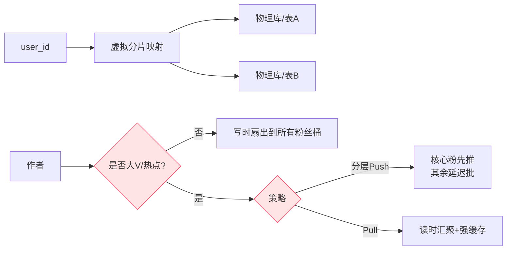

---

## 第五部分：发布写路径（强建议：Outbox + CDC）

步骤：

1) 事务写 posts + outbox（同库同事务，保证事件不丢）
2) CDC（PG 逻辑解码 wal2json/pgoutput/Debezium）消费 outbox → Kafka topic: post_published
3) 扇出服务（Fanout Workers）：
   - 依据作者与粉丝分桶映射，将 post 批量 UPSERT 到 inbox（ON CONFLICT DO NOTHING），支持批量写入/重试/幂等去重键(user_id, post_id)
   - 大V按策略切换：Pull 或分层 Push（如“核心粉→活跃粉→普通粉”）
4) 计数与索引：异步写 counts/ES（搜索）/缓存预热

时序与一致性：

- 用户自身视角（作者页）强一致（事务可见）；粉丝时间线最终一致（秒级），窗口可观测（队列积压、落地耗时 p95/p99）。

发布→扇出时序：

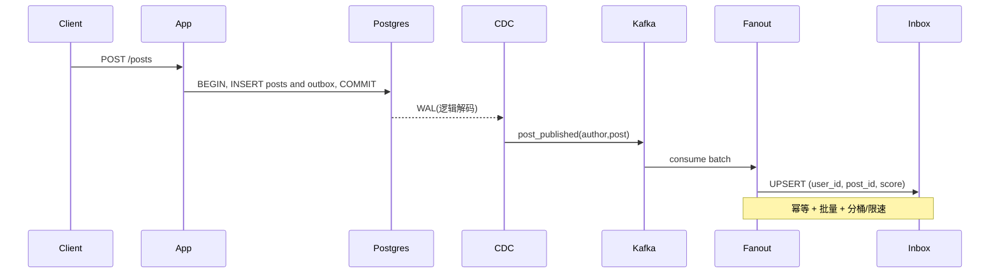

---

## 第六部分：时间线读取与分页

- Seek-based Pagination：基于 (score, post_id) 进行“向后滚动”，避免 deep offset；
- SQL 示例：

```sql
-- 第一页
SELECT post_id, score, created_at
FROM inbox
WHERE user_id = $1
ORDER BY score DESC, post_id DESC
LIMIT $limit;

-- 下一页
SELECT post_id, score, created_at
FROM inbox
WHERE user_id = $1
  AND (score, post_id) < ($last_score, $last_post_id)
ORDER BY score DESC, post_id DESC
LIMIT $limit;
```

- 可见性过滤与屏蔽：可选择写时预标注/读时过滤，需权衡存储与延迟。

读取与分页（seek）示意：

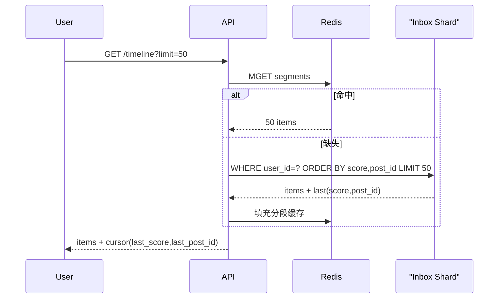

---

## 第七部分：排序与推荐（Real-time + Offline）

- 基础排序：时间衰减 + 质量分（文本/媒体质量、作者活跃度、社交关系权重）。
- 召回：关注关系召回 + 热点召回 + 相似兴趣召回（embedding/ANN）；
- 排序：在线轻量模型（LR/Tree/MAB）重排 Top-K；
- 特征：实时埋点 → 流式计算（Flink/Kafka Streams）→ 特征存储；
- 冷启动：默认时间排序 + 基础质量分，逐步引入个性化。

---

## 第八部分：缓存策略

- L1（进程内）+ L2（Redis）多级缓存：
  - Redis 分段 Key：timeline:{user}:{seg}，每段 100~200 条；
  - 写入后针对作者相关人群的“命中段”做局部刷新（或延迟失效）；
  - 负缓存与合并请求（防穿透）
- 热点保护：单用户互斥/小窗口抖动合并，防止缓存雪崩。

---

## 第九部分：一致性与修复

- 事件级幂等：去重键 (user_id, post_id, op) + UPSERT；
- 实时核对：对发布事件延迟 T 秒（如 5s）抽样核对 inbox 是否落地，不一致→自动补偿；
- 增量校对：基于 CDC 偏移/时间窗口校验最近变更；
- 全量回灌：从 outbox/CDC 位置重放重建 inbox（单源日志 → 可重建一切衍生存储）。

---

## 第十部分：计数与互动

- 点赞/评论/转发：事件流聚合（at-least-once + 幂等增量），页面展示可用近似值（如 HLL 估算）+ 定期精确校准；
- 去重防刷：用户维度速率限制/设备指纹/异常检测。

---

## 第十一部分：媒体与分发

- 图片/视频转码与多码率：离线/准实时；
- CDN：边缘缓存 + 预热；
- 访问控制：签名 URL、过期策略。

---

## 第十二部分：权限、合规与治理

- 可见性规则、拉黑/屏蔽在写读两侧均需处理；
- 账号删除（GDPR）：软删 + 异步彻底擦除（含索引/缓存/CDN 失效）；
- 审计与追踪：trace_id 贯穿发帖→扇出→落地→查询链路。

---

## 第十三部分：PostgreSQL 实践要点

- 分区：posts 按时间分区；inbox 物化为按 user_hash 或 bucket 分表；
- 索引：复合索引 (user_id, score DESC, post_id DESC)，BRIN(created_at) 用于时间范围扫描；
- 批量写：COPY/批量 UPSERT；
- CDC：开启 `logical_replication`，使用 wal2json/pgoutput 或 Debezium PG Connector，将 outbox 事件推至 Kafka；
- 不把 PG 当消息队列：扇出队列用 Kafka/Redpanda/NATS；
- 真正大体量时，时间线热层可迁至 KV/列存（如 Redis/Scylla/ClickHouse），PG 承载核心事实与强约束表。

---

## 第十四部分：容量与 SLO

- 写入：发布 QPS 峰值、扇出吞吐（条/秒）、落地延迟 p95/p99、队列积压上限与背压策略；
- 读取：时间线查询 p50/p95/p99、缓存命中率、降级比率；
- 一致性：不一致率、自动修复成功率与延迟、回灌耗时；
- 热点：大V发布限速、分桶写放大曲线、读侧保护命中。

SLO 视图（示意）：

```mermaid
gantt
  title 发布与落地窗口
  dateFormat  X
  axisFormat  %s
  section 写入
  App确认(<=50ms)   :0, 50
  section CDC
  出队/投递(<=200ms):0, 200
  section 落地
  扇出落地P99(<=2s) :0, 2000
```

---

## 第十五部分：本地验证建议

- 小规模验证“写时 vs 读时 vs 混合”的相对收益与热点治理：
  - 构造：N 作者、M 粉丝分布（长尾 + 大V），测量发布总时延、扇出队列落地延迟、时间线查询延迟与缓存命中；
  - 使用 Seek 分页与批量 UPSERT，观测 p95/p99 与积压阈值；
  - 切换大V为 Pull 或分层 Push，比较资源占用与窗口时长。

---

## 第十六部分：关键权衡与选型指南（Trade-offs）

- 扇出策略
  - Push（写时扇出）
    - 优点：读路径局部、延迟稳定、缓存命中率高。
    - 代价：写放大；大V发布易尖峰；回放/补偿成本上升。
    - 适用：粉丝量中小、强实时作者。
  - Pull（读时扇出）
    - 优点：写轻；热点发布更稳。
    - 代价：读侧复杂、跨分片聚合；高度依赖缓存。
    - 适用：超大V/热点、人群分层。
  - Hybrid（推荐）
    - 策略线：粉丝数 > T1 或预计扇出写入 > W 阈值 → Pull/分层 Push；否则 Push。
    - 典型阈值：T1≈50万~100万；W≈单分片写入接近 p95 余量的 70%。

- 存储冗余：全文 vs 仅 ID
  - 全文冗余到 inbox
    - 优点：单次读取即可返回。
    - 代价：存储/IO/更新放大极高；编辑/回滚困难。
  - 仅冗余 ID + 轻量字段（score/ts/publisher_id）（推荐）
    - 优点：成本最低、幂等写简单；与缓存/对象存储解耦。
    - 代价：二段读取（inbox→posts），需良好缓存命中。

- 分片键选择
  - 按发布人（author_id）：写局部但读跨库，时间线查询退化为扇出读。
  - 按订阅人（user_id）（推荐）：读局部；写跨库由扇出服务承担。

- 一致性 vs 延迟
  - Outbox+CDC 保证“不丢事件”；粉丝时间线最终一致（秒级窗口）。
  - 小圈子强实时：直读作者 outbox 或短路 Push。

- TTL/窗口 vs 全量留存
  - 时间线只需近 N 天/近 K 条；陈旧内容回源作者页。
  - 建议：inbox 保留 7~30 天或 1~3 万条/用户，超出滚动淘汰。

- 容量估算（粗量级）
  - 用户 5e8，人均发布 200 → 帖子数 P≈1e11。
  - 平均粉丝数 d≈100，则日新增 p_day≈P/365≈2.74e8，扇出≈2.74e10/天。
  - 若 inbox 单行≈80B（含索引粗估），保留 r=7 天：容量≈2.74e10×7×80B≈15.3TB（热层，未含副本）。
  - 采用大V Pull/分层 Push、只对活跃人群 Push，可显著降低写放大与容量。

- 成本控制手段
  - 仅冗余 ID；活跃度分层；分段缓存；seek 分页；限速/退避；增量校验与回灌；热点节流。

- 决策清单
  - SLO：发布确认与时间线拉取 P99；
  - 阈值：粉丝阈值 T1、活跃粉占比 A%、分片 p95 写入余量；
  - 窗口：inbox TTL 或 Top-K；
  - 兜底：缓存降级、Pull 回源、补偿回放。

## 第十七部分：本地运行与测试（已开源实现）

- 仓库地址：https://github.com/d60-Lab/RelationGraph
- 启动本地 Postgres（端口 5433）：
  - docker run -d --name rg-pg -p 5433:5432 -e POSTGRES_DB=gin_template -e POSTGRES_USER=postgres -e POSTGRES_PASSWORD=postgres postgres:15-alpine
  - config/config.yaml 中 database.port 已设为 5433（若你用自带 PG，请改回 5432）。
- 执行时间线扇出基准：
  - N=5000 POSTS=50 WORKERS=8 BATCH=1000 CLAIM=1 go run ./cmd/timelinebench
  - 含流程：建用户与关注→事务写 posts+outbox→Fanout 批量 UPSERT inbox→统计 p50/p95/p99；并测一次 timeline 首页读取。
- 执行“多分片并发读”对比：
  - go run ./cmd/fanoutbench
  - 对比单分片查询 vs 64 分片并发读的延迟。

测试结果（Mac+Docker，本机样例，仅供量级参考）：

- timelinebench（N=5000, POSTS=50, WORKERS=8, BATCH=1000, CLAIM=1）
  - Publish 事务：avg≈0.9ms（p95≈2.8ms）
  - 扇出落地窗口（outbox→done，每帖扇出 5k 行）：avg≈16.3s（p95≈29.0s）
  - Timeline 首屏读取 50 条：≈1.9ms
- fanoutbench（64 分片并发读）：avg≈30.0ms（p95≈51.0ms，p99≈91.0ms）

说明：上述实现采取“仅在 inbox 冗余 ID+轻字段、Push 扇出、批量 UPSERT、复合唯一(user_id,post_id)”；通过 WORKERS/BATCH/CLAIM 可调节吞吐与窗口，以观察 Trade-off。

## 总结：理念与取舍

1) 写读扇出没有银弹，混合策略在多数社交产品上性价比最高；
2) 以 Outbox/CDC 为“单一事实来源”，所有衍生存储（inbox/索引/缓存）均可回放重建；
3) 以 SLO 驱动：发布确认时延、落地延迟与不一致窗口可观测且可控；
4) 分片与热点治理是工程成败的关键：虚拟分片、分桶、限速与缓存协同。

> 与关系链一样，信息发布系统的本质亦是：在复杂性、性能与成本间找“适合当下”的平衡，并为未来演进留好钩子。

---

## 附：图解补充（上手更直观）

### A1. 发布路径：普通作者 vs 大V（混合策略）

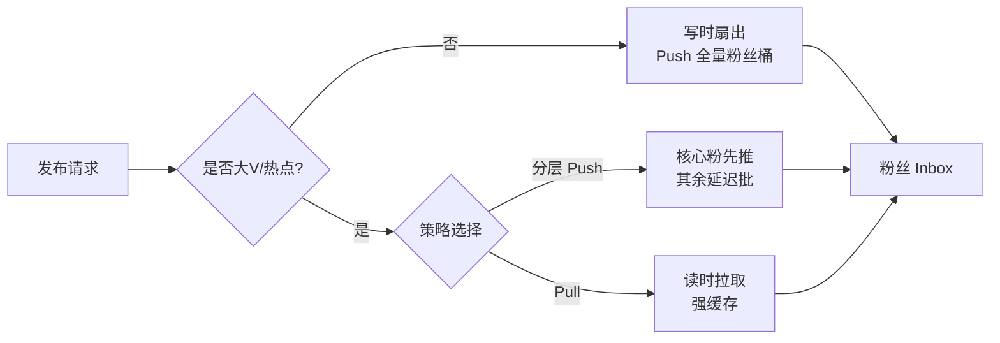

### A2. Inbox 分片与 per-user buckets

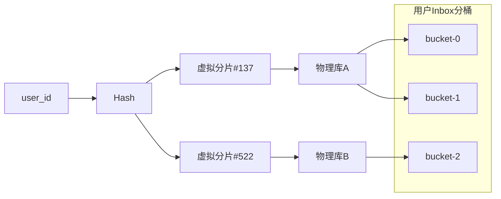

### A3. 缓存命中比例（示例）

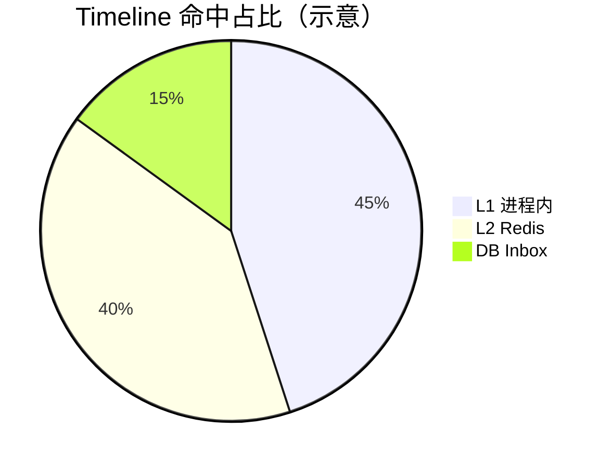

### A4. 一致性保护（实时核对 + 增量 + 全量）

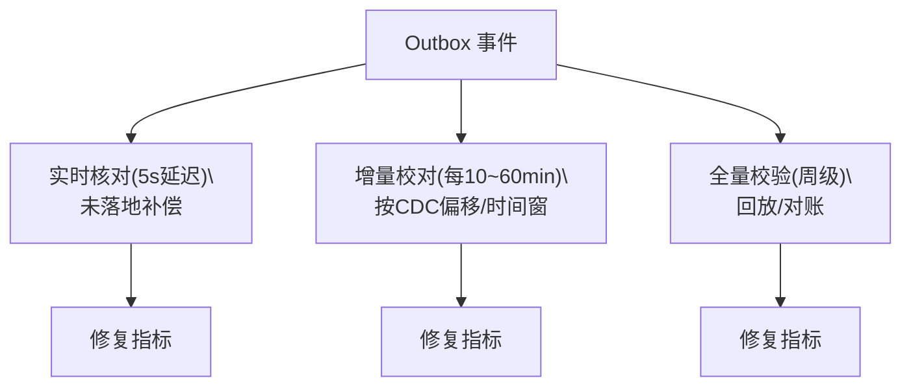

### A5. 背压与限速（扇出保护）

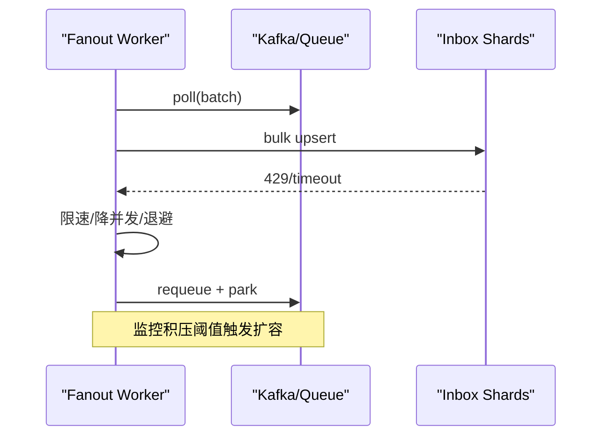

### A6. 可见性过滤流水线


### A7. 读取降级决策树

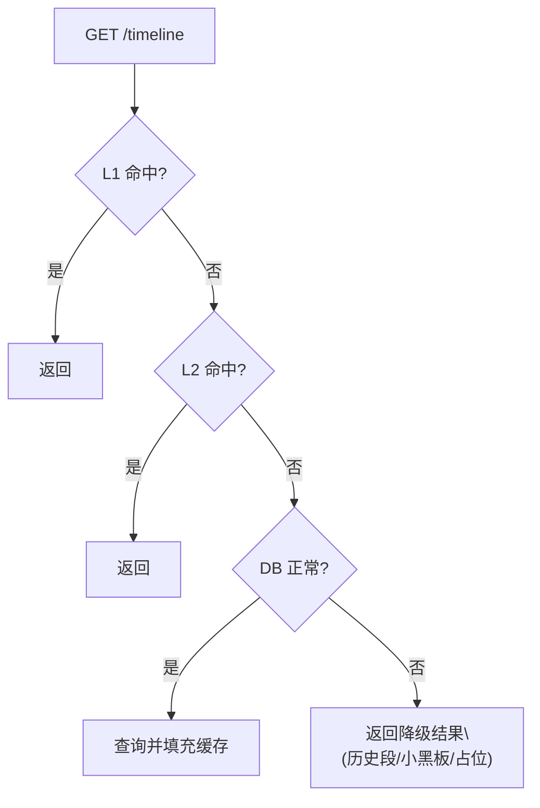

### A8. CDC 拓扑（PostgreSQL）

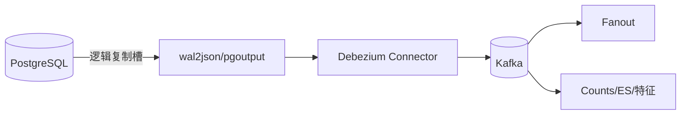

### A9. 分层推送时间线（示意）

```mermaid
gantt
  title 大V分层推送
  dateFormat  X
  axisFormat  %s
  section 核心粉
  立即推送 :0, 800
  section 活跃粉
  轻限速 :400, 1800
  section 普通粉
  批量/夜间 :1200, 7200
```

### A10. 本地验证步骤

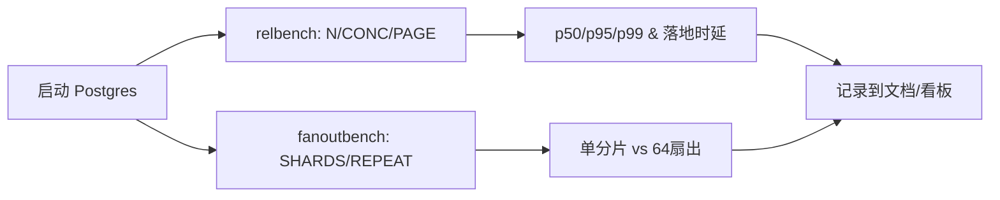

